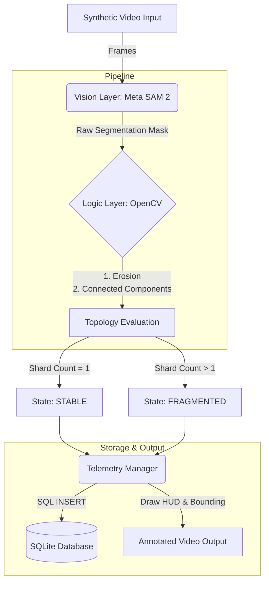

# Autonomous Warehouse Perception System (SAM 2 + SQL)

> **A hybrid Computer Vision pipeline that gives "Memory" and "Logic" to Foundation Models.**


## The Problem Statement
Modern Foundation Models like **Meta's SAM 2** are excellent at *seeing* pixels (Segmentation) but lack *understanding* of physical state changes. If a package in a warehouse falls and breaks, SAM 2 sees it as "deforming," not "breaking." It lacks the logic to trigger an alert.

## The Solution
I engineered a wrapper system that treats SAM 2 as a raw sensor and adds a **Deterministic Logic Layer** on top.
1.  **Vision (SAM 2):** Tracks the object's pixel mask frame-by-frame.
2.  **Logic (OpenCV):** Analyzes the mask topology in real-time. If the mask splits into distinct, disconnected islands, it triggers a **"FRAGMENTATION EVENT."**
3.  **Memory (SQLite):** Instantly logs the timestamp, coordinates, and risk level of the event into a local SQL database for post-incident analysis.

---

## System Architecture


---

## Key Features

* **Zero-Shot Tracking:** Integrates **SAM 2 (Segment Anything Model 2)** to track arbitrary objects without re-training.
* **State Machine Logic:** Uses `cv2.connectedComponents` to detect topological changes (e.g., Multi-Shard Mitosis events where 1 object splits into 4+ independent fragments (in v2) and Splits/Fractures (in v1)) that pure Deep Learning misses.
* **"Peanut" Prompting Strategy:** Implemented a novel masking strategy to force the model to track debris fields (multi-part objects) by initializing the tracker with a unified multi-centroid mask.
* **SQL Telemetry Backend:** A lightweight `sqlite3` integration that logs robot perception data at 30Hz, enabling SQL queries like `"SELECT * FROM logs WHERE status='Critical'"`.

---

## Tech Stack

* **Core Logic:** Python 3.10
* **AI/ML:** PyTorch, Meta SAM 2
* **Computer Vision:** OpenCV, NumPy, PIL
* **Data/Backend:** SQLite, Pandas

---

## Performance & Results

### Visual Output
*The system detects the exact frame where the object splits, switches status from SAFE (Green) to CRITICAL (Red), and logs the event.*


### Database Query Result
Automatically generated incident report from the SQL backend:
```text
  FRACTURE DETECTED AT FRAME: 43
   Time of Incident: 16:33:22.88
   Risk Score: 0.95 (CRITICAL)
```

### Cloud-Native Deployment & Observability
In a real warehouse, this system would run as a Kubernetes DaemonSet on edge nodes equipped with GPUs.

The integration of SQLite isn't just for storage; it transforms raw video into a queryable telemetry stream. In a production environment, this local DB can be scraped by a Prometheus Exporter to trigger cluster-wide alerts when a `FRAGMENTATION_EVENT` is detected.

*Running with Docker*
```bash
# 1. Build the high-performance vision image
docker build -t warehouse-sam2 .

# 2. Run with GPU support and mount a local folder for the video/DB output
docker run --gpus all \
  -v $(pwd)/output:/app/data \
  warehouse-sam2
```
### Local Installation & Usage
1. Clone the Repository
   ```bash
   git clone [https://github.com/alfayezahmad/warehouse-vision-sam2.git](https://github.com/alfayezahmad/warehouse-vision-sam2.git)
   cd warehouse-vision-sam2
   ```
2. Install Dependencies
   ```bash
   pip install -r requirements.txt
   pip install git+[https://github.com/facebookresearch/segment-anything-2.git](https://github.com/facebookresearch/segment-anything-2.git)
   ```
3. Download Model Weights
   ```bash
   wget [https://dl.fbaipublicfiles.com/segment_anything_2/072824/sam2_hiera_large.pt](https://dl.fbaipublicfiles.com/segment_anything_2/072824/sam2_hiera_large.pt)
   ```
4. Run the Pipeline
   ```bash
   python main_pipeline_v2.py
   ```
### Roadmap: From Edge to Cluster
- [ ] **Protobuf/gRPC Interface:** Replace SQLite with a gRPC stream to send real-time shard coordinates to a central robot controller.
- [ ] **OpenTelemetry Integration:** Map vision events to OTel spans to trace the "perception-to-action" latency.
- [ ] **TensorRT Optimization:** Quantize the SAM 2 weights for faster inference on NVIDIA Jetson edge devices.
